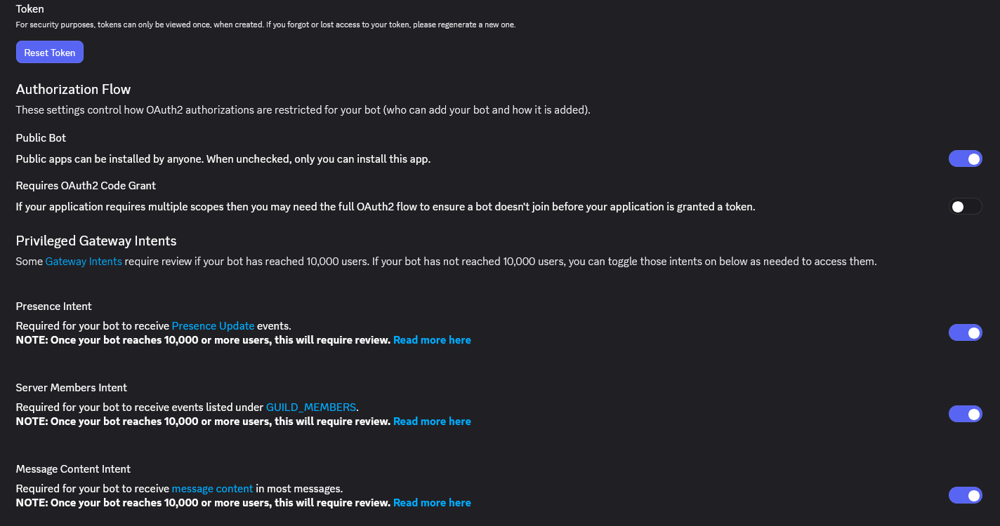
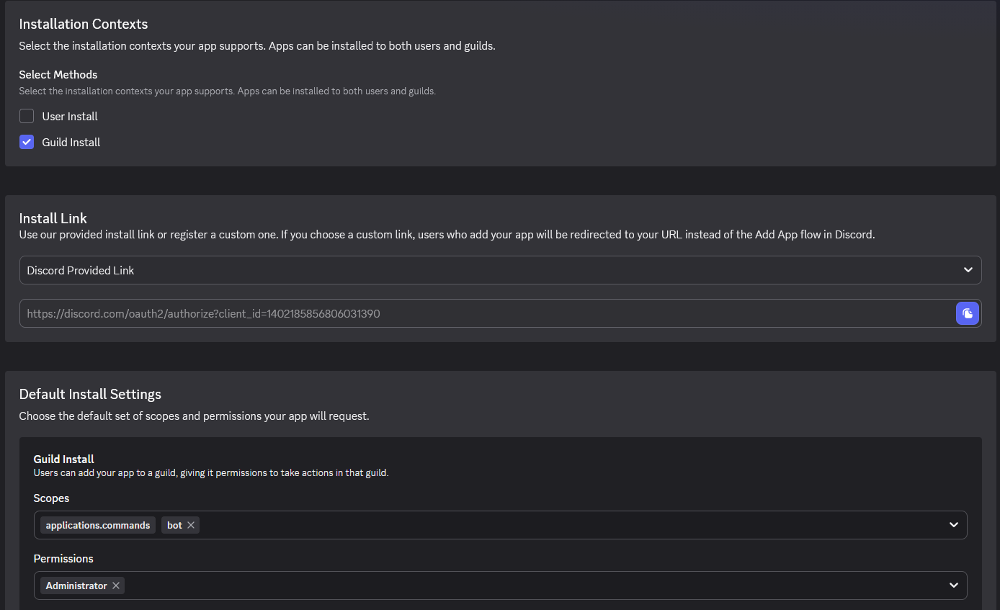

# Self-hosting Bolt

This nifty little guide will run you through setting up your own instance of Bolt on your machine.

## Prerequisites

Before starting, you'll need:

* Any OS that can run Python
* Python itself (duh)
  * recommended to use CPython, however PyPy works too.
* A Discord bot and a token

### Python dependencies

* Python 3.10+
* [`py-cord`](https://pypi.org/project/py-cord/) (`pip install py-cord`)
* [`python-dotenv`](https://pypi.org/project/python-dotenv/) (`pip install python-dotenv`)
* [`requests`](https://pypi.org/project/requests/) (`pip install requests`)
* If using Python 3.13+, also install [`audioop-lts`](https://pypi.org/project/audioop-lts) 
> pycord apparently insists on using it even without using audio features. thanks, pycord.
* Optional: [`colorama`](https://pypi.org/project/colorama) to make the logs look better

---

## Creating a Discord Bot

1. Go to the [Discord Developer Portal](https://discord.com/developers/home/)
2. Create a new application.
3. Go to the **Bot** tab.
4. Copy the token. You'll need it later.

> **IMPORTANT**
>
> Do **NOT** share your token with **anyone**.
> 
> Anyone with your bot's token can control your bot.

## Inviting the Bot to your Server

### Intents

After creating your Bot, you'll need to set up its intents.

Go to the **Bot** tab and enable:
- **Message content intent**
- **Server members intent**

You can find the permissions used on the main branch of Bolt here:


Then, go to the **Installation** tab and:
- select **Guild Install** in **Installation Contexts**
- select **Discord Provided Link** in **Install Link**
- in **Default Install Settings**, select the **`applications.commands`** and **`bot`** scopes,
- and the **Administrator** permission.
> Bolt requires admin because a lot of moderation actions need broad access to your server.
> This could change in the future.



Copy the link provided by Discord.

---

## Installing the Bot

First, clone the repo:

```bash
git clone https://github.com/sparkhere-sys/bolt.git && cd bolt
```

Next, set up a virtual environment. (no, not a virtual machine.) 

The instructions will vary depending on your OS of choice.

* Linux/macOS:

```bash
python3 -m venv .venv && source ./.venv/bin/activate
```

* Windows (PowerShell):

```powershell
py -m venv .venv
.\.venv\Scripts\Activate.ps1
```

Now install all the dependencies:

```bash
pip install -r requirements.txt # or you can install them manually
```

Create a `.env` file in the root directory of the repo, and add your bot's token:
```ini
TOKEN=your_token_here
```

Then, copy the `example_config.toml` file to `config.toml`, and edit it to your preferences.

Once all of that is done, run:
```bash
python -m bot
```

to start the bot.

To stop Bolt, press Ctrl+C in your console/terminal, or use your service manager if you're running Bolt as a service.

## Updating your Bot

Updating your bot is simple!

Pull the latest changes with Git:
```sh
git pull
```

Update the dependencies:
```sh
pip install -r requirements.txt
```

And then restart Bolt.

## Troubleshooting

### My bot doesn't start.

Check the console output. Bolt will usually tell you what went wrong.

Common issues:
- Invalid bot token
- Missing dependencies
- Python is too old

### My bot is online, but its commands don't work.

Make sure:
- The bot has the required permissions
- The required intents are enabled
- The bot was invited with the `applications.commands` scope
- The cog you're trying to load isn't disabled in your `config.toml`

### My bot is reconnecting to Discord.

This usually means you have multiple instances of Bolt running with the same token.

Close any extra instances of Bolt. Only one instance should run per bot.